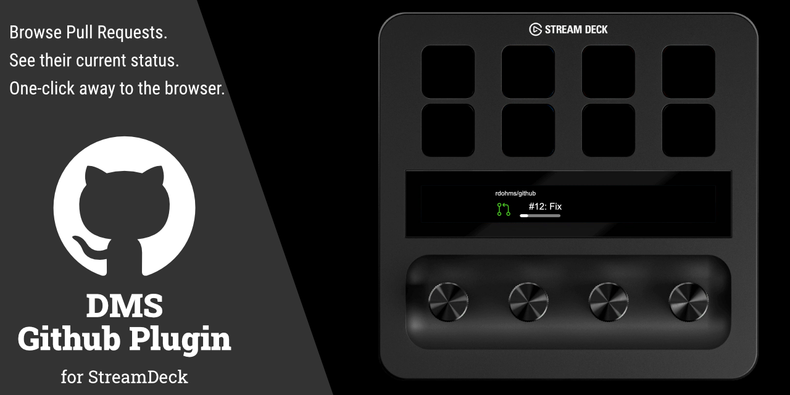
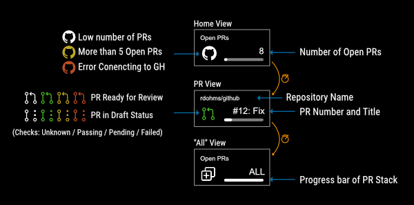

# DMS Github PRs Plugin

A plugin for Github utilities.

Features:

- **View Requested Reviews:** Use the Dial controls to view a list, and the status of PRs awaiting your review.

## Installation (from Elgato Store)

TBD (will be available after the first release)

## Installation (from Source Code)

1. Visit
   <https://github.com/rdohms/com.dms.streamdeck.github/raw/main/release/com.dms.streamdeck.github.streamDeckPlugin>
2. Go to the download folder and open `com.dms.streamdeck.github.streamDeckPlugin`.
3. Drag the "View Requested Reviews" Action to one of the Dials.

## Usage

Once the plugin starts the main display on the touch screen will show you the number of currently Open PRs, this is the "Home Screen".
You may now engage with the Dial:
- **Rotating** the dial will navigate over: Home Screen <-> Individual PRs... <-> ALL <-> Home Screen
- **Pressing the dial** will open: the PR list page, the desired PR or ALL (in individual tabs)

[//TODO]: # (- **Pressing the Touch Screen** will auto-switch you back to the Home Screen)
[//TODO]: # (- **Long Pressing** will trigger a reload)

What each display means:

## Maintainer

- [Rafael Dohms](https://github.com/rdohms)

## Contributors

- <https://github.com/rdohms/com.dms.streamdeck.github/contributors>

## Contributing

For more details about how to contribute, please read
<https://github.com/rdohms/com.dms.streamdeck.github/blob/main/CONTRIBUTING.md>.

## License

The plugin is available as open source under the terms of the
[MIT License](https://opensource.org/licenses/MIT). A copy of the license can be
found at <https://github.com/rdohms/com.dms.streamdeck.github/blob/main/LICENSE.md>.

## Code of Conduct

Everyone interacting in the com.dms.streamdeck.github project's codebases, issue trackers, chat
rooms and mailing lists is expected to follow the
[code of conduct](https://github.com/rdohms/com.dms.streamdeck.github/blob/main/CODE_OF_CONDUCT.md).
